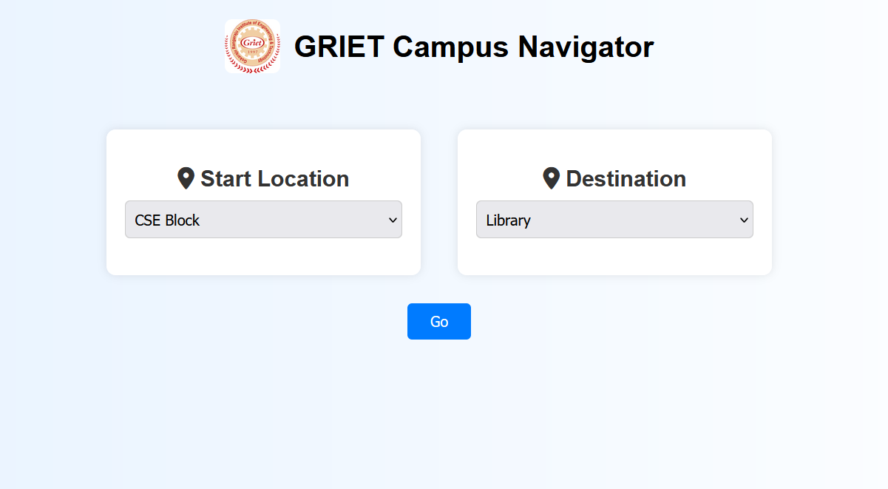
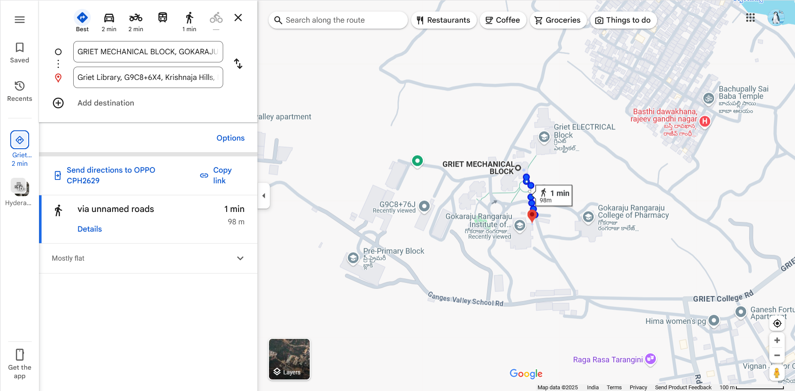

# GRIET Campus Navigator using A* Algorithm

This is a web-based campus navigation system built for GRIET (Gokaraju Rangaraju Institute of Engineering and Technology) using the A* pathfinding algorithm. It helps students and visitors find the shortest path between different blocks within the campus using a map-based interface powered by Google Maps.


## Features

- A* (A-star) algorithm for optimal and efficient pathfinding  
- Google Maps integration to visualize navigation  
- Dropdown UI to select Start and Destination blocks  
- Displays real-time route with clickable directions  


## Tech Stack

- **Frontend**: HTML, CSS, Jinja2 (Flask templates)  
- **Backend**: Python (Flask)  
- **Algorithm**: A* Algorithm with Haversine heuristic  


## Install Dependencies
```bash
pip install flask
```

## Run the Application
```bash
python app.py
```
- Then open your browser and go to:
  http://127.0.0.1:5000

## Results

Here’s how the campus navigation looks in action:


## Frontend UI




## Path Result


